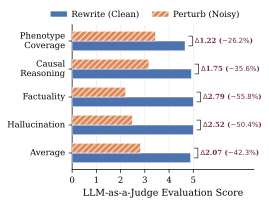
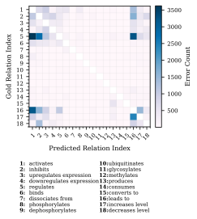

# BIOME-Bench

**A Benchmark for Biomolecular Interaction Inference and Multi-Omics Pathway Mechanism Elucidation**

<div align="center">
   <br/>
    <span>*Logo generated by Nano Banana*</span>
</div>
<p align="center">
    <b>🌐 Language:</b> English | <a href="README-zh.md">中文</a>
</p>


## 🌟 Overview

**BIOME-Bench** is a literature-grounded evaluation framework for assessing large language models on two core capabilities:

* **Biomolecular Interaction Inference (BII)**
* **End-to-end Multi-Omics Pathway Mechanism Elucidation (MPME)**

Multi-omics profiling, including proteomics, metabolomics, and single-cell transcriptomics, has become central to studying complex biological systems and disease mechanisms. In practice, researchers often rely on **Pathway Enrichment Analysis** to interpret coordinated molecular changes across regulatory layers, as illustrated below:

<div align="center">
  
</div>

However, this enrichment-based workflow faces several persistent bottlenecks:

1. **Curation Lag**: Pathway knowledgebases are curated and versioned, which can delay incorporation of newly discovered or context-specific mechanisms.
2. **Functional Redundancy**: Enrichment results frequently contain heavily overlapping gene sets, producing long lists of near-duplicate pathways that are difficult to prioritize.
3. **Context-insensitivity**: Enrichment scores are largely context-agnostic. They do not represent molecular states (e.g., phosphorylation or activation), intervention directionality, or the multi-hop causal structure required to connect perturbed entities to pathway-level phenotypes.

Recent advances in large language models offer opportunities to improve pathway-centric interpretation, for example by reducing redundancy and generating mechanistic narratives. Yet progress remains difficult to measure because there is still **no standardized benchmark that evaluates end-to-end mechanistic elucidation**—namely, whether a model can directly infer a coherent, causally grounded **mechanistic chain** from **multi-omics perturbation observations**, conditioned on pathway context.

**BIOME-Bench** addresses this gap. Given **observed perturbed entities** and a **pathway context**, it requires models to generate coherent, state-aware, intervention-consistent mechanistic explanation.

The figure below shows the core workflow used to construct BIOME-Bench from the literature:

<div align="center">
  
</div>

## 🏗️ Data Construction

BIOME-Bench transforms pathway information and literature evidence into a structured, validated knowledge representation through four stages:

### Phase I: Literature Retrieval and Relevance Filtering

To ensure strong biological validity, the construction process begins with a rigorous literature acquisition stage. Let

$$
\mathcal{P} = \lbrace p_1, p_2, \dots, p_n \rbrace
$$

denote a predefined set of target KEGG pathways. Each pathway $p_i$ is characterized by its pathway name $N_{p_i}$ and associated species $S_{p_i}$.

#### MeSH-guided Literature Retrieval

For each pathway $p_i$, we perform a structured literature search on the PubMed database using Medical Subject Headings (MeSH)  to improve recall precision and semantic consistency. Specifically, the pathway name $N_{p_i}$ is mapped to a set of MeSH descriptors, denoted as $\mathrm{MeSH}(N_{p_i})$, and the species $S_{p_i}$ is mapped to the corresponding MeSH organism term, denoted as $\mathrm{MeSH}(S_{p_i})$.

The final PubMed query is constructed as a conjunction of pathway-related MeSH terms and species constraints:

$$
Q(p_i) = \mathrm{MeSH}(N_{p_i}) \wedge \mathrm{MeSH}(S_{p_i}).
$$

Executing $Q(p_i)$ yields an initial candidate document set:

$$
D_{\text{candidate}}(p_i) = \lbrace d_1, d_2, \dots, d_m \rbrace,
$$

where each document $d_j$ is indexed by PubMed and annotated with curated MeSH terms.

#### LLM-based Semantic and Mechanistic Relevance Scoring

MeSH-guided retrieval yields a controlled, high-recall candidate set, but MeSH annotations alone do not ensure that an article contains pathway-specific mechanistic evidence. To identify literature suitable for mechanism-level benchmarking, we use an LLM-based semantic evaluator with parameters $\theta$.

Given a document and pathway pair $(d, p_i)$, the evaluator assigns a relevance score

$$
s = f_{\theta}(d, p_i), \quad s \in [0,10],
$$

where $f_{\theta}$ aggregates multiple biologically motivated dimensions:

$$
f_{\theta}(d, p_i)=g_{\theta}(\mathbf{S}),
\qquad
\mathbf{S}=
\begin{bmatrix}
S_{\text{subj}}\\
S_{\text{spec}}\\
S_{\text{mol}}\\
S_{\text{ctx}}
\end{bmatrix}.
$$

- $S_{\text{subj}}$ measures whether the pathway’s biological process is the primary focus of the article, as opposed to a background mention.
- $S_{\text{spec}}$ measures whether the organism studied matches the pathway species. It also credits appropriate model organisms used to study human physiology or disease while penalizing biologically unrelated species.
- $S_{\text{mol}}$ measures whether the article mentions pathway-defined molecular entities, such as genes, enzymes, or metabolites.
- $S_{\text{ctx}}$ measures whether the article describes pathway regulation, such as activation, inhibition, or other modulatory effects, rather than merely reporting pathway presence.

We retain a document only if it exceeds a strict relevance threshold:

$$
D_{\text{relevant}}(p_i)=\lbrace d \in D_{\text{candidate}}(p_i) \mid f_{\theta}(d,p_i)\ge \alpha \rbrace.
$$


In this work, we set $\alpha = 8$ to prioritize articles in which the target pathway is central and supported by explicit molecular and regulatory evidence.

------

### Phase II: Information Extraction and Entity Standardization

#### LLM-based Mechanistic Extraction

For each document $d \in D_{\text{relevant}}(p_i)$, we process the abstract using a LLM to produce two complementary outputs:

1. **Raw Entity Set** $E_{\text{raw}}$: a collection of mentioned biological entities categorized into Chemicals, Genes/Proteins, and Phenotypes.
2. **Mechanism Description** $M_{\text{text}}$: a coherent natural language explanation describing the molecular interactions and regulatory mechanisms reported in the document. This text later serves as ground truth for generative evaluation.

#### Entity Normalization and Ontology Mapping

To ensure interoperability with external biological resources, we normalize each raw entity $e \in E_{\text{raw}}$ to a canonical identifier using an ontology resolution function $\phi(e)$. Specifically:

- **Chemical entities** are mapped to PubChem compound identifiers (CIDs) using PubChemPy.
- **Genes and proteins** are mapped to NCBI Gene identifiers or UniProt accessions via MyGene.info.

To improve benchmark quality, we discard a candidate document if any entity cannot be resolved to a valid identifier. Only documents for which all entities are successfully normalized are retained, yielding the standardized entity set:

$$
E_{\text{std}}=\left\lbrace \phi(e)\mid e\in E_{\text{raw}} \wedge \forall e'\in E_{\text{raw}},\ \phi(e')\neq\emptyset \right\rbrace
$$

------

### Phase III: Knowledge Structuring and Validation

This phase converts extracted mechanistic information into a fine-grained, state-aware knowledge graph representation.

#### Interaction Quadruple Extraction

We first extract the core interaction structure from $M_{\text{text}}$. Each interaction is represented as a quadruple:

$$
T_{\text{core}} = (e_s, r, e_t, c),
$$

where $e_s, e_t \in E_{\text{std}}$ denote the source and target entities, $r \in \mathcal{R}$ is a relation type drawn from a controlled biological vocabulary, and $c$ specifies the biological condition under which the interaction occurs.

#### Biological State Annotation

To capture dynamic molecular behavior, we further annotate entity-specific biological states. Let $\sigma_s$ and $\sigma_t$ denote the states of the source and target entities, respectively (e.g., mutated, overexpressed). Incorporating state information yields a state-aware hexaplet representation:

$$
T_{\text{final}} = (e_s, \sigma_s, r, e_t, \sigma_t, c).
$$

This formulation enables the benchmark to distinguish subtle yet critical mechanistic differences, such as changes in protein abundance versus post-translational modifications.

#### Human Expert Verification

To establish a high-confidence gold standard, we perform human-in-the-loop validation. A randomly sampled subset of the constructed knowledge graph entries is reviewed by domain experts in molecular biology and systems biology, who cross-check each entry against the supporting literature to verify its accuracy and grounding.

------

### Phase IV: BIOME-Bench Task Formulation

Based on the curated and validated knowledge representations, BIOME-Bench defines two complementary evaluation tasks.

#### Task A: Biomolecular Interaction Inference

This task evaluates an LLM’s ability to infer precise molecular relationships within a pathway context. Given a pathway $p_i$, a source entity $e_s$ with state $\sigma_s$, a target entity $e_t$ with state $\sigma_t$, and a biological condition $c$, the model is required to predict the correct interaction relation from a finite controlled vocabulary $\mathcal{R}$:

$$
\hat{r} = \arg\max_{r \in \mathcal{R}} P\bigl(r \mid p_i, e_s, \sigma_s, e_t, \sigma_t, c\bigr).
$$

#### Task B: Multi-Omics Pathway Mechanism Elucidation

This task simulates realistic omics-driven pathway analysis scenarios. The model is provided with a pathway context $p_i$ and a set of differentially observed entities

$$
E_{\text{diff}} \subseteq E_{\text{std}},
$$

and is required to generate a coherent mechanistic explanation $\hat{Y}$ that elucidates the biological interactions, regulatory relationships, and molecular processes connecting these entities within the given pathway context.

## 📈 Benchmark Statistics

| **Species** | **Pathways** | **Entities** | **Processes & Phenotypes** | **Task A: Biomolecular Interaction Inference** | **Task B: Multi-Omics Pathway Mechanism Elucidation** |
| ----------- | ------------ | ------------ | -------------------------- | ---------------------------------------------- | ----------------------------------------------------- |
| `hsa`       | 80           | 1,349        | 1,781                      | 4,032                                          | 490                                                   |
| `mmu`       | 80           | 1,356        | 1,860                      | 4,162                                          | 496                                                   |
| `rno`       | 80           | 1,141        | 1,265                      | 3,384                                          | 361                                                   |
| **Total**   | **240**      | **3,846**    | **4,906**                  | **11,578**                                     | **1,347**                                             |

BIOME-Bench is a multi-species benchmark that covers three commonly used organisms: hsa (human), mmu (mouse), and rno (rat). The table above summarizes the core statistics, including the numbers of curated pathways, standardized entities, process and phenotype terms, mechanism analysis instances, and knowledge graph relations. Overall, it includes 1347 instances for  multi-omics mechanism elucidation and 11578 instances  for biomolecular interaction inference, both evaluated under consistent pathway contexts.

## 🧩 Evaluation Protocol and Metrics

### Task A: Biomolecular Interaction Inference

We evaluate relation prediction using **Accuracy** and **Macro-F1**.

### Task B: Multi-Omics Pathway Mechanism Elucidation

For generated explanations, we adopt a multi-dimensional evaluation strategy:

1. **LLM-as-a-Judge**: We use **Qwen3-32B** as the judge model. Given the ground-truth mechanism text $M_{\text{text}}$, it scores the generated explanation $\hat{Y}$ on four dimensions (1–5): **Phenotype Coverage**, **Causal Reasoning**, **Factuality**, and **Hallucination Control**.

2. **Structured Knowledge Evaluation**: Based on the literature-derived knowledge graph, we adopt a closed-set protocol. We use **Qwen3-32B** as the extractor model and only allow tuples selected from the standardized knowledge graph to support $\hat{Y}$, ensuring $\mathcal{T}_{\text{pred}}\subseteq\mathcal{T}_{\text{GT}}$ . Factual completeness is measured via **Coverage**:

$$
\text{Coverage} = \frac{|\mathcal{T}_{\text{pred}}|}{|\mathcal{T}_{\text{GT}}|}
$$

3. **Semantic Embedding Similarity**: We compute cosine similarity between vector embeddings of $\hat{Y}$ and the reference mechanism text $M_{\text{text}}$.

## 📊 Experimental Results

The table below summarizes model performance on BIOME-Bench:

<div align="center">
  <table style="border-collapse: collapse; width: 100%; font-family: sans-serif; font-size: 13px; text-align: center;">
    <thead>
      <tr style="border-top: 2px solid black;">
        <th rowspan="4" style="border-bottom: 1px solid black; padding: 8px;"><strong>Model</strong></th>
        <th colspan="2" style="padding: 8px;"><strong>Biomolecular Interaction</strong></th>
        <th colspan="6" rowspan="2" style="padding: 8px;"><strong>Multi-Omics Pathway Mechanism Elucidation</strong></th>
        <th rowspan="4" style="border-bottom: 1px solid black; padding: 8px;"><strong>Avg.</strong></th>
      </tr>
      <tr>
        <th colspan="2" style="border-bottom: 1px solid black; padding: 8px;"><strong>Inference</strong></th>
      </tr>
      <tr>
        <th rowspan="2" style="border-bottom: 1px solid black; padding: 8px;">Acc</th>
        <th rowspan="2" style="border-bottom: 1px solid black; padding: 8px;">Macro-F1</th>
        <th colspan="4" style="border-bottom: 1px solid black; padding: 8px;">LLM-as-a-Judge</th>
        <th rowspan="2" style="border-bottom: 1px solid black; padding: 8px;">Similarity</th>
        <th rowspan="2" style="border-bottom: 1px solid black; padding: 8px;">Coverage</th>
      </tr>
      <tr>
        <th style="border-bottom: 1px solid black; padding: 8px;">Phenotype Coverage</th>
        <th style="border-bottom: 1px solid black; padding: 8px;">Causal Reasoning</th>
        <th style="border-bottom: 1px solid black; padding: 8px;">Factuality</th>
        <th style="border-bottom: 1px solid black; padding: 8px;">Hallucination</th>
      </tr>
    </thead>
    <tbody>
      <tr>
        <td style="text-align: left; padding: 6px;">Qwen3-14B</td>
        <td>47.43</td><td>43.72</td><td>3.12</td><td>3.31</td><td>3.97</td><td>4.64</td><td>78.73</td><td>42.38</td><td>64.13</td>
      </tr>
      <tr>
        <td style="text-align: left; padding: 6px;">Qwen3-32B</td>
        <td>41.84</td><td>40.51</td><td>3.00</td><td>3.26</td><td>3.89</td><td>4.79</td><td>78.98</td><td>45.43</td><td>63.20</td>
      </tr>
      <tr>
        <td style="text-align: left; padding: 6px;">Qwen3-235B</td>
        <td>51.41</td><td>46.21</td><td>3.66</td><td>4.32</td><td>4.54</td><td>4.40</td><td>77.34</td><td>42.22</td><td>69.45</td>
      </tr>
      <tr>
        <td style="text-align: left; padding: 6px;">GLM-4.6</td>
        <td>53.60</td><td>50.08</td><td>3.50</td><td>4.14</td><td>4.32</td><td>4.18</td><td>76.89</td><td>39.95</td><td>67.92</td>
      </tr>
      <tr>
        <td style="text-align: left; padding: 6px;">DeepSeek-V3.2-R1</td>
        <td>53.10</td><td>47.52</td><td>3.28</td><td>4.31</td><td>4.20</td><td>4.10</td><td>75.12</td><td>40.76</td><td>66.79</td>
      </tr>
      <tr>
        <td style="text-align: left; padding: 6px;">Gemini3-Pro</td>
        <td>52.34</td><td>46.54</td><td>3.60</td><td>4.57</td><td>4.59</td><td>4.54</td><td>77.21</td><td>41.13</td><td>69.74</td>
      </tr>
      <tr>
        <td style="text-align: left; padding: 6px;">GPT-5.2</td>
        <td>54.66</td><td>50.70</td><td>3.68</td><td>4.58</td><td>4.69</td><td>4.62</td><td>71.38</td><td>37.49</td><td>70.70</td>
      </tr>
      <tr>
        <td style="text-align: left; padding: 6px;">Doubao-Seed-1.8</td>
        <td>55.42</td><td>50.40</td><td>3.81</td><td>4.69</td><td>4.69</td><td>4.57</td><td>74.92</td><td>39.72</td><td>71.96</td>
      </tr>
      <tr style="border-bottom: 2px solid black;">
        <td style="text-align: left; padding: 6px;">Intern-S1-235B</td>
        <td>54.15</td><td>50.36</td><td>3.96</td><td>4.28</td><td>4.75</td><td>4.92</td><td>78.71</td><td>44.49</td><td><strong>73.24</strong></td>
      </tr>
    </tbody>
  </table>
</div>

The following figure reports the sensitivity of the Qwen3-32B judge model to semantic perturbations. It records scores for the rewritten (rewrite) and perturbed (perturb) versions. Drop% denotes the relative score decrease from rewrite to perturb:

<div align="center">
  
</div>

The results validate the effectiveness of LLM-as-a-Judge.

The figure below shows the confusion matrix of prediction errors for biomolecular interaction inference. Rows denote gold relation types and columns denote predicted types. Color intensity indicates the number of instances where a gold relation is misclassified as a predicted relation.

<div align="center">
  
</div>

These results indicate that models tend to collapse fine-grained biological mechanisms into coarse causal or regulatory relations (e.g., `leads_to`) and struggle to distinguish direct regulation from pathway-level causation. Over-interpretation of underspecified relations (e.g., polarizing `regulates`) and limited fine-grained discrimination reflect current models’ limitations in handling complex biological logic.

## 🚀 Quick Start

### 1. Environment Setup

Make sure Python 3.10+ is installed.

```bash
# 克隆仓库
git clone url
cd BIOME-Bench

# 安装依赖
pip install -r requirements.txt
```

### 2. Configuration (`config/config.json`)

Before running, you **must** configure the model endpoints. Below is a complete configuration example, including the evaluated model, judge model, and embedding model:

```json
{
  "EvalModel": {
    "api_config": {
      "model": "EvalModel",
      "base_url": "http://localhost:8000/v1",
      "api_key": "EMPTY",
      "timeout": 60,
      "max_retries": 10
    },
    "generation_config": {
      "temperature": 0.0,
      "max_tokens": 10240,
      "no_think": false,
      "thinking_rules_file": "config/thinking_rules.json"
    },
    "save_every": 10
  },
  "JudgeModel": {
    "api_config": {
      "model": "Qwen3-32B",
      "base_url": "http://localhost:8001/v1",
      "api_key": "sk-..."
    },
    "generation_config": {
      "max_tokens": 10240,
      "temperature": 0.0
    }
  },
  "EmbedModel": {
    "api_config": {
      "model": "Qwen3-8B-Embedding",
      "base_url": "http://localhost:8002/v1",
      "api_key": "sk-..."
    }
  }
}
```

### 3. Run the Demo (One Command)

Use the example data in `data/` to quickly validate the pipeline:

```bash
# Run Demo (quick validation using a one-example test set)
python run_demo.py --threads 1
```

### 4. Run the Full Evaluation (One Command)

```bash
# Run the full evaluation (full dataset with a specified config)
python run_pipeline.py --config config/my_config.json --threads 1
```

## 🛠️ Manual Pipeline

### Stage 1: Model Inference

Use the `evaluation` module to run batch inference on the dataset.

```bash
# Task-A
python -m evaluation run \
  --data data/TASK-A.jsonl \
  --task-type relation_prediction \
  --config config/config.json \
  --threads 1

# Task-B
python -m evaluation run \
  --data data/TASK-B.jsonl \
  --task-type mechanism_analysis \
  --config config/config.json \
  --threads 1
```

If your endpoint supports high-concurrency inference, increase `threads` to speed up evaluation.

### Stage 2: Scoring and Metric Computation

#### 1. Task A: Relation Prediction Accuracy

```bash
python metrics/biomolecular_interaction_inference_acc.py \
  --input outputs/your_run/results.jsonl
```

#### 2. Task B: Mechanism Analysis (LLM-as-a-Judge)

**Note**: You must provide species-specific knowledgebase files via `--db`.

```bash
python metrics/LLM-as-a-Judge.py \
  --results outputs/your_run/results.jsonl \
  --db data/hsa.jsonl data/mmu.jsonl data/rno.jsonl \
  --output outputs/your_run/judge_results.jsonl \
  --threads 1
```

## 🧠 Advanced Features

### Thinking Rules (`config/thinking_rules.json`)

Special handling for reasoning models (e.g., Qwen3), supporting dynamic injection of prompt prefixes.

### Resume & Recovery

The framework automatically creates `checkpoint.json` in the run directory. If execution is interrupted, rerun the same command or use `--resume-run-id` to resume progress.

## 📂 Project Structure

```
BIOME-Bench/
├── config/              # configs and thinking rules
├── data/                # cleaned knowledgebases and test sets
├── evaluation/          # core inference engine
├── metrics/             # scoring modules and judge prompts
└── outputs/             # results and evaluation reports
```

## 📄 Data Format

Below is one example from `data\TASK-B.jsonl` for multi-omics pathway mechanism elucidation:

```json
{
    "messages": [
        {
            "role": "user",
            "content": "**Pathway Context**: Bladder cancer - Homo sapiens (human)\n\nDetermine the specific biological relationship between the Source and Target entities under the given Condition.\nYou must select the relationship strictly from the following vocabulary:\n['activates', 'inhibits', 'upregulates_expression', 'downregulates_expression', 'regulates', 'binds', 'dissociates_from', 'phosphorylates', 'dephosphorylates', 'ubiquitinates', 'glycosylates', 'methylates', 'produces', 'consumes', 'converts_to', 'leads_to', 'increases_level', 'decreases_level']\n\n**Source**: SIGLEC12 (elevated expression)\n**Target**: oncogenic signaling (upregulation)\n**Condition**: in bladder cancer\n\nRespond with the exact relation name from the list above."
        },
        {
            "role": "assistant",
            "content": "upregulates_expression"
        }
    ],
    "pathway_id": "hsa05219",
    "pubmed_id": "41303731",
    "species": "hsa"
}
```

The corresponding pathway details, paper metadata, relevance assessment, standardized entities, and knowledge graph can be found in the species-specific `data\hsa.jsonl` by matching `pathway_id` and `pubmed_id`:

```json
{
    "id": "hsa05219",
    "name": "Bladder cancer - Homo sapiens (human)",
    "description": "The urothelium covers the luminal surface of almost the entire urinary tract, extending from the renal pelvis, through the ureter and bladder, to the proximal urethra. The majority of urothelial carcinoma are bladder carcinomas, and urothelial carcinomas of the renal pelvis and ureter account for only approximately 7% of the total. Urothelial tumours arise and evolve through divergent phenotypic pathways. Some tumours progress from urothelial hyperplasia to low-grade non-invasive superficial papillary tumours. More aggressive variants arise either from flat, high-grade carcinoma in situ (CIS) and progress to invasive tumours, or they arise de novo as invasive tumours. Low-grade papillary tumors frequently show a constitutive activation of the receptor tyrosine kinase-Ras pathway, exhibiting activating mutations in the HRAS and fibroblast growth factor receptor 3 (FGFR3) genes. In contrast, CIS and invasive tumors frequently show alterations in the TP53 and RB genes and pathways. Invasion and metastases are promoted by several factors that alter the tumour microenvironment, including the aberrant expression of E-cadherins (E-cad), matrix metalloproteinases (MMPs), angiogenic factors such as vascular endothelial growth factor (VEGF).",
    "genes": [
        "1019"
    ],
    "pubmed": [
        {
            "pmid": "41303731",
            "title": "Decoding SIGLEC12 in Bladder Cancer: In Silico Profiling of Expression, Tumor-Immune Interactions, and Prognostic Impact.",
            "abstract": "Background and Objectives: Siglec-XII, encoded by SIGLEC12, is a unique sialic acid-binding immunoglobulin-like lectin. It lacks a highly conserved R122 residue for sialic acid recognition in humans. Although it is upregulated in bladder cancer (BCa), its role in tumorigenesis remains largely unexplored. This study aims to investigate the expression patterns of SIGLEC12 in BCa and its correlation with disease features. Materials and Methods: An integrated analysis of transcriptomic data and clinical profiles was conducted using various databases and tools, including UALCAN, GEPIA, TIMER, CAMOIP, and CPADs. The analyses encompassed SIGLEC12 expression, survival rates, immune infiltration levels, promoter methylation, and correlation with drug response. Results: SIGLEC12 expression was higher in both low-grade papillary and high-grade invasive non-papillary BCa. Higher SIGLEC12 expression resulting from low promoter hypomethylation was detected at the stage II-IV of BCa, and was unrelated to disease stages and metastatic stages. Elevated SIGLEC12 expression correlated with increased immune cell infiltration, higher expression of oncogenic and immune checkpoint blockade-related genes, and drug resistance signatures. Mutation analysis confirmed the absence of the canonical R122 missense mutation, indicating that the structural integrity and potential functionality of Siglec-XII are preserved in BCa. Conclusions: SIGLEC12 may have sialic acid recognition functions and serve as a potential early biomarker of BCa.",
            "authors": "Rathore V; Lin WW",
            "fulltext_url": null,
            "keywords": "Bladder cancer[MeSH Terms] AND human[MeSH Terms]",
            "llm_relevance_assessment": {
                "relevance_score": 8,
                "relevance_level": "High",
                "species_check": "The pathway is human (Homo sapiens), and the article uses human-derived bladder cancer transcriptomic data and clinical profiles. Species match is valid.",    
                "evidence_summary": [
                    "SIGLEC12 expression was higher in both low-grade papillary and high-grade invasive non-papillary BCa.",
                    "Elevated SIGLEC12 expression correlated with increased immune cell infiltration, higher expression of oncogenic and immune checkpoint blockade-related genes, and drug resistance signatures."
                ],
                "reasoning": "The article directly investigates SIGLEC12 in the context of human bladder cancer, aligning with the KEGG pathway 'Bladder cancer - Homo sapiens'. It provides evidence of its expression patterns, association with immune infiltration, and potential role in oncogenic and immune checkpoint-related pathways. While it does not explicitly discuss all the genetic alterations (e.g., FGFR3, TP53, RB) mentioned in the pathway, it offers meaningful biological context and pathway-level insights into tumor-immune interactions and disease progression, placing it in the high relevance category."
            },
            "standardized_entities": {
                "chemicals": [],
                "genes_proteins": [
                    {
                        "original": "SIGLEC12",
                        "standard_name": "SIGLEC12",
                        "status": "success",
                        "source_db": "NCBI_Gene",
                        "entrez_id": "89858",
                        "official_symbol": "SIGLEC12",
                        "full_name": "sialic acid binding Ig like lectin 12",
                        "summary": "Sialic acid-binding immunoglobulin-like lectins (SIGLECs) are a family of cell surface proteins belonging to the immunoglobulin superfamily. They mediate protein-carbohydrate interactions by selectively binding to different sialic acid moieties present on glycolipids and glycoproteins. This gene encodes a member of the SIGLEC3-like subfamily of SIGLECs. Members of this subfamily are characterized by an extracellular V-set immunoglobulin-like domain followed by two C2-set immunoglobulin-like domains, and the cytoplasmic tyrosine-based motifs ITIM and SLAM-like. The encoded protein, upon tyrosine phosphorylation, has been shown to recruit the Src homology 2 domain-containing protein-tyrosine phosphatases SHP1 and SHP2. It has been suggested that the protein is involved in the negative regulation of macrophage signaling by functioning as an inhibitory receptor. This gene is located in a cluster with other SIGLEC3-like genes on 19q13.4. Alternative splicing results in multiple transcript variants. [provided by RefSeq, Aug 2013].",
                        "go_process": [
                            "cell adhesion",
                            "cell adhesion"
                        ],
                        "uniprot_id": "Q96PQ1"
                    },
                    {
                        "original": "Siglec-XII",
                        "standard_name": "SIGLEC12",
                        "status": "success",
                        "source_db": "NCBI_Gene",
                        "entrez_id": "89858",
                        "official_symbol": "SIGLEC12",
                        "full_name": "sialic acid binding Ig like lectin 12",
                        "summary": "Sialic acid-binding immunoglobulin-like lectins (SIGLECs) are a family of cell surface proteins belonging to the immunoglobulin superfamily. They mediate protein-carbohydrate interactions by selectively binding to different sialic acid moieties present on glycolipids and glycoproteins. This gene encodes a member of the SIGLEC3-like subfamily of SIGLECs. Members of this subfamily are characterized by an extracellular V-set immunoglobulin-like domain followed by two C2-set immunoglobulin-like domains, and the cytoplasmic tyrosine-based motifs ITIM and SLAM-like. The encoded protein, upon tyrosine phosphorylation, has been shown to recruit the Src homology 2 domain-containing protein-tyrosine phosphatases SHP1 and SHP2. It has been suggested that the protein is involved in the negative regulation of macrophage signaling by functioning as an inhibitory receptor. This gene is located in a cluster with other SIGLEC3-like genes on 19q13.4. Alternative splicing results in multiple transcript variants. [provided by RefSeq, Aug 2013].",
                        "go_process": [
                            "cell adhesion",
                            "cell adhesion"
                        ],
                        "uniprot_id": "Q96PQ1"
                    },
                    {
                        "original": "R122",
                        "standard_name": "arginine at position 122 of SIGLEC12",
                        "status": "success",
                        "source_db": "NCBI_Gene",
                        "entrez_id": "89858",
                        "official_symbol": "SIGLEC12",
                        "full_name": "sialic acid binding Ig like lectin 12",
                        "summary": "Sialic acid-binding immunoglobulin-like lectins (SIGLECs) are a family of cell surface proteins belonging to the immunoglobulin superfamily. They mediate protein-carbohydrate interactions by selectively binding to different sialic acid moieties present on glycolipids and glycoproteins. This gene encodes a member of the SIGLEC3-like subfamily of SIGLECs. Members of this subfamily are characterized by an extracellular V-set immunoglobulin-like domain followed by two C2-set immunoglobulin-like domains, and the cytoplasmic tyrosine-based motifs ITIM and SLAM-like. The encoded protein, upon tyrosine phosphorylation, has been shown to recruit the Src homology 2 domain-containing protein-tyrosine phosphatases SHP1 and SHP2. It has been suggested that the protein is involved in the negative regulation of macrophage signaling by functioning as an inhibitory receptor. This gene is located in a cluster with other SIGLEC3-like genes on 19q13.4. Alternative splicing results in multiple transcript variants. [provided by RefSeq, Aug 2013].",
                        "go_process": [
                            "cell adhesion",
                            "cell adhesion"
                        ],
                        "uniprot_id": "Q96PQ1"
                    },
                    {
                        "original": "E-cad",
                        "standard_name": "E-cadherin",
                        "status": "success",
                        "source_db": "NCBI_Gene",
                        "entrez_id": "999",
                        "official_symbol": "CDH1",
                        "full_name": "cadherin 1",
                        "summary": "This gene encodes a classical cadherin of the cadherin superfamily. Alternative splicing results in multiple transcript variants, at least one of which encodes a preproprotein that is proteolytically processed to generate the mature glycoprotein. This calcium-dependent cell-cell adhesion protein is comprised of five extracellular cadherin repeats, a transmembrane region and a highly conserved cytoplasmic tail. Mutations in this gene are correlated with gastric, breast, colorectal, thyroid and ovarian cancer. Loss of function of this gene is thought to contribute to cancer progression by increasing proliferation, invasion, and/or metastasis. The ectodomain of this protein mediates bacterial adhesion to mammalian cells and the cytoplasmic domain is required for internalization. This gene is present in a gene cluster with other members of the cadherin family on chromosome 16. [provided by RefSeq, Nov 2015].",
                        "go_process": [
                            "cell morphogenesis",
                            "desmosome assembly",
                            "cell-cell junction assembly"
                        ],
                        "uniprot_id": "P12830"
                    },
                    {
                        "original": "MMPs",
                        "standard_name": "matrix metalloproteinases",
                        "status": "success",
                        "source_db": "NCBI_Gene",
                        "entrez_id": "4319",
                        "official_symbol": "MMP10",
                        "full_name": "matrix metallopeptidase 10",
                        "summary": "This gene encodes a member of the peptidase M10 family of matrix metalloproteinases (MMPs). Proteins in this family are involved in the breakdown of extracellular matrix in normal physiological processes, such as embryonic development, reproduction, and tissue remodeling, as well as in disease processes, such as arthritis and metastasis. The encoded preproprotein is proteolytically processed to generate the mature protease. This secreted protease breaks down fibronectin, laminin, elastin, proteoglycan core protein, gelatins, and several types of collagen. The gene is part of a cluster of MMP genes on chromosome 11. [provided by RefSeq, Jan 2016].",
                        "go_process": [
                            "proteolysis",
                            "proteolysis",
                            "extracellular matrix disassembly"
                        ],
                        "uniprot_id": "P09238"
                    },
                    {
                        "original": "VEGF",
                        "standard_name": "vascular endothelial growth factor",
                        "status": "success",
                        "source_db": "NCBI_Gene",
                        "entrez_id": "2277",
                        "official_symbol": "VEGFD",
                        "full_name": "vascular endothelial growth factor D",
                        "summary": "The protein encoded by this gene is a member of the platelet-derived growth factor/vascular endothelial growth factor (PDGF/VEGF) family and is active in angiogenesis, lymphangiogenesis, and endothelial cell growth. This secreted protein undergoes a complex proteolytic maturation, generating multiple processed forms which bind and activate VEGFR-2 and VEGFR-3 receptors. This protein is structurally and functionally similar to vascular endothelial growth factor C. Read-through transcription has been observed between this locus and the upstream PIR (GeneID 8544) locus. [provided by RefSeq, Feb 2011].",
                        "go_process": [
                            "angiogenesis",
                            "response to hypoxia",
                            "sprouting angiogenesis"
                        ],
                        "uniprot_id": "O43915"
                    },
                    {
                        "original": "HRAS",
                        "standard_name": "HRAS",
                        "status": "success",
                        "source_db": "NCBI_Gene",
                        "entrez_id": "3265",
                        "official_symbol": "HRAS",
                        "full_name": "HRas proto-oncogene, GTPase",
                        "summary": "This gene belongs to the Ras oncogene family, whose members are related to the transforming genes of mammalian sarcoma retroviruses. The products encoded by these genes function in signal transduction pathways. These proteins can bind GTP and GDP, and they have intrinsic GTPase activity. This protein undergoes a continuous cycle of de- and re-palmitoylation, which regulates its rapid exchange between the plasma membrane and the Golgi apparatus. Mutations in this gene cause Costello syndrome, a disease characterized by increased growth at the prenatal stage, growth deficiency at the postnatal stage, predisposition to tumor formation, cognitive disability, skin and musculoskeletal abnormalities, distinctive facial appearance and cardiovascular abnormalities. Defects in this gene are implicated in a variety of cancers, including bladder cancer, follicular thyroid cancer, and oral squamous cell carcinoma. Multiple transcript variants, which encode different isoforms, have been identified for this gene. [provided by RefSeq, Jul 2008].",
                        "go_process": [
                            "MAPK cascade",
                            "MAPK cascade",
                            "regulation of transcription by RNA polymerase II"
                        ],
                        "uniprot_id": "P01112"
                    },
                    {
                        "original": "FGFR3",
                        "standard_name": "fibroblast growth factor receptor 3",
                        "status": "success",
                        "source_db": "NCBI_Gene",
                        "entrez_id": "2261",
                        "official_symbol": "FGFR3",
                        "full_name": "fibroblast growth factor receptor 3",
                        "summary": "This gene encodes a member of the fibroblast growth factor receptor (FGFR) family, with its amino acid sequence being highly conserved between members and among divergent species. FGFR family members differ from one another in their ligand affinities and tissue distribution. A full-length representative protein would consist of an extracellular region, composed of three immunoglobulin-like domains, a single hydrophobic membrane-spanning segment and a cytoplasmic tyrosine kinase domain. The extracellular portion of the protein interacts with fibroblast growth factors, setting in motion a cascade of downstream signals, ultimately influencing mitogenesis and differentiation. This particular family member binds acidic and basic fibroblast growth hormone and plays a role in bone development and maintenance. Mutations in this gene lead to craniosynostosis and multiple types of skeletal dysplasia. [provided by RefSeq, Aug 2017].",
                        "go_process": [
                            "MAPK cascade",
                            "skeletal system development",
                            "ossification"
                        ],
                        "uniprot_id": "P22607"
                    },
                    {
                        "original": "TP53",
                        "standard_name": "TP53",
                        "status": "success",
                        "source_db": "NCBI_Gene",
                        "entrez_id": "7157",
                        "official_symbol": "TP53",
                        "full_name": "tumor protein p53",
                        "summary": "This gene encodes a tumor suppressor protein containing transcriptional activation, DNA binding, and oligomerization domains. The encoded protein responds to diverse cellular stresses to regulate expression of target genes, thereby inducing cell cycle arrest, apoptosis, senescence, DNA repair, or changes in metabolism. Mutations in this gene are associated with a variety of human cancers, including hereditary cancers such as Li-Fraumeni syndrome. Alternative splicing of this gene and the use of alternate promoters result in multiple transcript variants and isoforms. Additional isoforms have also been shown to result from the use of alternate translation initiation codons from identical transcript variants (PMIDs: 12032546, 20937277). [provided by RefSeq, Dec 2016].",
                        "go_process": [
                            "negative regulation of transcription by RNA polymerase II",
                            "negative regulation of transcription by RNA polymerase II",
                            "negative regulation of transcription by RNA polymerase II"
                        ],
                        "uniprot_id": "P04637"
                    },
                    {
                        "original": "RB",
                        "standard_name": "RB1",
                        "status": "success",
                        "source_db": "NCBI_Gene",
                        "entrez_id": "5925",
                        "official_symbol": "RB1",
                        "full_name": "RB transcriptional corepressor 1",
                        "summary": "The protein encoded by this gene is a negative regulator of the cell cycle and was the first tumor suppressor gene found. The encoded protein also stabilizes constitutive heterochromatin to maintain the overall chromatin structure. The active, hypophosphorylated form of the protein binds transcription factor E2F1. Defects in this gene are a cause of childhood cancer retinoblastoma (RB), bladder cancer, and osteogenic sarcoma. [provided by RefSeq, Jul 2008].",
                        "go_process": [
                            "G1/S transition of mitotic cell cycle",
                            "negative regulation of transcription by RNA polymerase II",
                            "negative regulation of transcription by RNA polymerase II"
                        ],
                        "uniprot_id": "P06400"
                    },
                    {
                        "original": "E-cadherins",
                        "standard_name": "E-cadherin",
                        "status": "success",
                        "source_db": "NCBI_Gene",
                        "entrez_id": "999",
                        "official_symbol": "CDH1",
                        "full_name": "cadherin 1",
                        "summary": "This gene encodes a classical cadherin of the cadherin superfamily. Alternative splicing results in multiple transcript variants, at least one of which encodes a preproprotein that is proteolytically processed to generate the mature glycoprotein. This calcium-dependent cell-cell adhesion protein is comprised of five extracellular cadherin repeats, a transmembrane region and a highly conserved cytoplasmic tail. Mutations in this gene are correlated with gastric, breast, colorectal, thyroid and ovarian cancer. Loss of function of this gene is thought to contribute to cancer progression by increasing proliferation, invasion, and/or metastasis. The ectodomain of this protein mediates bacterial adhesion to mammalian cells and the cytoplasmic domain is required for internalization. This gene is present in a gene cluster with other members of the cadherin family on chromosome 16. [provided by RefSeq, Nov 2015].",
                        "go_process": [
                            "cell morphogenesis",
                            "desmosome assembly",
                            "cell-cell junction assembly"
                        ],
                        "uniprot_id": "P12830"
                    }
                ],
                "processes_phenotypes": [
                    {
                        "original": "Bladder cancer",
                        "type": "phenotype"
                    },
                    {
                        "original": "Immune cell infiltration",
                        "type": "phenotype"
                    },
                    {
                        "original": "Oncogenic signaling",
                        "type": "phenotype"
                    },
                    {
                        "original": "Immune checkpoint blockade",
                        "type": "phenotype"
                    },
                    {
                        "original": "Drug resistance",
                        "type": "phenotype"
                    },
                    {
                        "original": "Tumor progression",
                        "type": "phenotype"
                    },
                    {
                        "original": "Metastasis",
                        "type": "phenotype"
                    }
                ]
            },
            "knowledge_graph": [
                {
                    "source": "SIGLEC12",
                    "source_state": "elevated expression",
                    "relation": "upregulates_expression",
                    "target": "oncogenic signaling",
                    "target_state": "upregulation",
                    "condition": "in bladder cancer"
                },
                {
                    "source": "SIGLEC12",
                    "source_state": "elevated expression",
                    "relation": "upregulates_expression",
                    "target": "immune checkpoint blockade",
                    "target_state": "upregulation",
                    "condition": "in bladder cancer"
                },
                {
                    "source": "SIGLEC12",
                    "source_state": "elevated expression",
                    "relation": "increases_level",
                    "target": "immune cell infiltration",
                    "target_state": "increased",
                    "condition": "in bladder cancer"
                },
                {
                    "source": "SIGLEC12",
                    "source_state": "elevated expression",
                    "relation": "leads_to",
                    "target": "drug resistance",
                    "target_state": "drug resistance signatures",
                    "condition": "in bladder cancer"
                },
                {
                    "source": "alterations in TP53",
                    "source_state": "alterations",
                    "relation": "leads_to",
                    "target": "tumor progression",
                    "target_state": "invasive tumor progression",
                    "condition": "in bladder cancer"
                },
                {
                    "source": "alterations in RB1",
                    "source_state": "alterations",
                    "relation": "leads_to",
                    "target": "tumor progression",
                    "target_state": "invasive tumor progression",
                    "condition": "in bladder cancer"
                },
                {
                    "source": "HRAS mutations",
                    "source_state": "mutations",
                    "relation": "leads_to",
                    "target": "low-grade papillary tumors",
                    "target_state": "Present",
                    "condition": "in bladder cancer"
                },
                {
                    "source": "FGFR3 mutations",
                    "source_state": "mutations",
                    "relation": "leads_to",
                    "target": "low-grade papillary tumors",
                    "target_state": "Present",
                    "condition": "in bladder cancer"
                },
                {
                    "source": "E-cadherin loss",
                    "source_state": "loss",
                    "relation": "facilitates",
                    "target": "tumor invasion",
                    "target_state": "Present",
                    "condition": "General"
                },
                {
                    "source": "matrix metalloproteinases",
                    "source_state": "Present",
                    "relation": "facilitates",
                    "target": "tumor invasion",
                    "target_state": "Present",
                    "condition": "General"
                },
                {
                    "source": "vascular endothelial growth factor",
                    "source_state": "Present",
                    "relation": "promotes",
                    "target": "angiogenesis",
                    "target_state": "Present",
                    "condition": "in bladder cancer"
                },
                {
                    "source": "angiogenesis",
                    "source_state": "Present",
                    "relation": "supports",
                    "target": "tumor growth",
                    "target_state": "Present",
                    "condition": "in bladder cancer"
                },
                {
                    "source": "angiogenesis",
                    "source_state": "Present",
                    "relation": "supports",
                    "target": "metastasis",
                    "target_state": "Present",
                    "condition": "in bladder cancer"
                }
            ]
        }
    ]
}
```

## 🙏 Acknowledgements

We thank the following projects and resources for supporting this work:

- [KEGG](https://www.kegg.jp/)
- [PubMed](https://pubmed.ncbi.nlm.nih.gov/)
- [PubChem](https://pubchem.ncbi.nlm.nih.gov/)
- [PubChemPy](https://github.com/mcs07/PubChemPy)
- [Genes - NCBI](https://uud.ncbi.nlm.nih.gov/home/genes/)
- [UniProt](https://www.uniprot.org/)
- [MyGene.info](https://github.com/biothings/mygene.info)
- [Qwen3](https://github.com/QwenLM/Qwen3)
- [GLM-4.6](https://huggingface.co/zai-org/GLM-4.6)
- [DeepSeek-R1](https://github.com/deepseek-ai/DeepSeek-R1)
- [Gemini 3](https://blog.google/products/gemini/gemini-3/)
- [GPT-5.2](https://openai.com/zh-Hans-CN/index/introducing-gpt-5-2/)
- [Doubao-Seed-1.8](https://console.volcengine.com/ark/region:ark+cn-beijing/model/detail?Id=doubao-seed-1-8)
- [Intern-S1](https://github.com/InternLM/Intern-S1)
- [Qwen3-Embedding](https://github.com/QwenLM/Qwen3-Embedding)
- [vllm](https://github.com/vllm-project/vllm)

## 📝 Citation

```
@misc{biomebench2025,
  title = {BIOME-Bench: A Benchmark for Biomolecular Interaction Inference and Multi-Omics Pathway Mechanism Elucidation},
  year = {2025},
  publisher = {GitHub},
  journal = {GitHub repository}
}
```